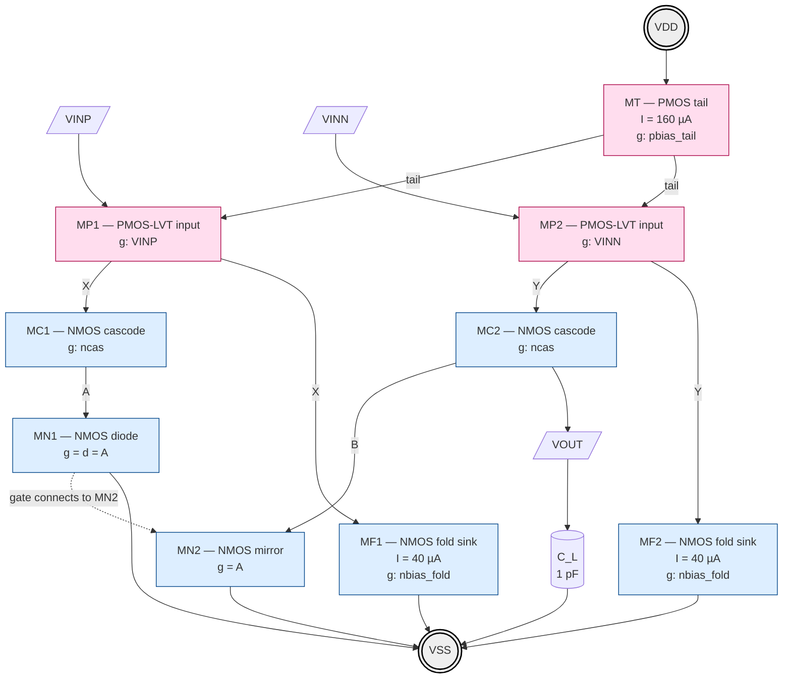

# lelo_fc_se_pmos_sky130a — Architecture

**Single-ended folded-cascode OTA, PMOS differential input, SKY130A 1.8 V.**

Differential in → single-ended out. No CMFB required: the output common-mode
is set by the NMOS cascode current mirror that performs the diff-to-single
conversion (the mirror enforces I_out_p = I_out_n by construction, so the
output node sits wherever it must to satisfy KCL — typically near mid-rail
when sized correctly).

## Why PMOS input here

| Reason                            | Consequence                              |
|-----------------------------------|------------------------------------------|
| Better 1/f noise at low freq      | PMOS has ~3-10× lower 1/f than NMOS      |
| Low input CM range (down to VSS)  | PMOS pair tail at top, accepts VIN ≈ 0   |
| Folded path drops to NMOS cascode | Output swing not limited by tail head    |
| Complements `lelo_fda_foldedcascode` (NMOS input) — same project, different flavour |

PMOS LVT (`sky130_fd_pr__pfet_01v8_lvt`, Vt ≈ 0.4 V) for the input pair
and PMOS tail to recover headroom at 1.8 V.

## Topology — Schematic (proper)

Two symmetric columns. Tail at the top, mirror at the bottom, fold sinks
on the outside, cascodes in the middle. Output is the right-column node B.

### Clean ASCII schematic

```
                              VDD
   ═══════════════════════════════════════════════════════════
                               │
                          ┌────┴────┐
            pbias_tail ──►┤   MT    │      I_TAIL = 160 µA
                          │  PMOS   │      (source = VDD)
                          └────┬────┘
                               │  drain
                  ┌────────────┴────────────┐
                  │                         │
              ┌───┴───┐                 ┌───┴───┐
       VINP──►┤  MP1  │                 │  MP2  ├◄──VINN
              │ PMOS  │                 │ PMOS  │
              │  LVT  │                 │  LVT  │
              └───┬───┘                 └───┬───┘
                  │ drain                   │ drain
                  ●  X                   Y  ●
                  │                         │
                  ├──────┐           ┌──────┤
                  │      │           │      │
              ┌───┴───┐  │           │  ┌───┴───┐
       ncas──►┤  MC1  │  │           │  │  MC2  │◄──ncas
              │ NMOS  │  │           │  │ NMOS  │
              │cascode│  │           │  │cascode│
              └───┬───┘  │           │  └───┬───┘
                  ●  A   │           │   B  ●═══════►  VOUT
                  │      │           │      │
                  │  ┌───┴───┐   ┌───┴───┐  │
                  │  │  MF1  │   │  MF2  │  │
                  │  │ NMOS  │   │ NMOS  │  │
                  │  │ sink  │◄──┤sink   │  │   gates ◄── nbias_fold
                  │  │40 µA  │   │40 µA  │  │
                  │  └───┬───┘   └───┬───┘  │
                  │      │           │      │
              ┌───┴───┐  │           │  ┌───┴───┐
              │  MN1  │  │           │  │  MN2  │
              │ NMOS  ●──┘           └──●  NMOS │  ← gate of MN2 = node A
              │ diode │  (gate=A)       │mirror │
              │40 µA  │                 │40 µA  │
              └───┬───┘                 └───┬───┘
                  │                         │
   ═══════════════════════════════════════════════════════════
                              VSS
```

**How to read it row by row:**

| row | left column           | right column          | what happens                     |
|-----|------------------------|------------------------|----------------------------------|
| 1   | VDD                    | VDD                    | supply rail                      |
| 2   | MT (PMOS tail)         | shared with left       | injects I_TAIL = 160 µA          |
| 3   | MP1 (PMOS input)       | MP2 (PMOS input)       | diff pair, gates = VINP / VINN   |
| 4   | node X                 | node Y                 | fold summing nodes               |
| 5   | MC1 (NMOS cascode)     | MC2 (NMOS cascode)     | boost r_out, gates = ncas        |
| 5b  | MF1 (NMOS fold sink)   | MF2 (NMOS fold sink)   | sink fixed 40 µA at X / Y        |
| 6   | node A (diode tap)     | node B = **VOUT**      | mirror in (A), signal out (B)    |
| 7   | MN1 (NMOS diode)       | MN2 (NMOS mirror)      | MN2 gate = A → copies left I     |
| 8   | VSS                    | VSS                    | return                           |

### Mermaid schematic (cleaner box-and-wire view)



### Reading the diagram

- **MT** sits at top, drain feeds the diff-pair sources (160 µA).
- **MP1, MP2** are the PMOS-LVT input pair; their drains go *down* into
  fold nodes X (left) and Y (right).
- At **X**: KCL says `I_MP1 = I_MF1 + I_MC1`. MF1 is a *fixed* 40 µA
  sink (high impedance), so any signal current `±gm·vid/2` from MP1
  has nowhere to go *except* up through MC1 into node A.
- **MC1, MC2** are cascodes biased by `ncas` — they don't change
  current, they just boost output impedance.
- **MN1** is diode-connected at A. Its Vgs sets the gate voltage that
  drives **MN2** (gate dotted line, A → MN2.g). So MN2 sinks the
  *same* current that MC1 delivered.
- At **B = VOUT**: MC2 pushes down `I_TAIL/2 + gm·vid/2`, MN2 pulls down
  `I_TAIL/2 − gm·vid/2` (mirrored from A). Difference = `gm·vid` →
  flows into C_L. This is the diff→single conversion.
- **No CMFB block exists.** The mirror MN1↔MN2 self-balances DC; the
  output node's DC voltage settles wherever both MC2 and MN2 are in
  saturation (typically near VDD/2 by symmetry).

### Voltage stack-up (typical corner, planned DC)

```
  VDD = 1.80 V  ───────────────────────────────────
                        │
              Vsd_MT  = 0.20 V    (Vov_p ≈ 0.20)
                        │
   tail node = 1.60 V  ─┤
                        │
              Vsg_MP  = 0.65 V    (Vt_p ≈ 0.45 + Vov ≈ 0.20)
                        │
   X, Y      = 0.95 V  ─┤  ← fold node
                        │
              Vds_MC  = 0.20 V    (NMOS cascode, kept at edge sat)
                        │
   A, B      = 0.75 V  ─┤  ← cascode drains / mirror drains  ← VOUT nominal
                        │
              Vds_MN  = 0.55 V → 0.75 V  (mirror device, room for swing)
                        │
              Vgs_MN  ≈ 0.55 V   (Vt_n ≈ 0.42 + Vov ≈ 0.13)
                        │
  VSS = 0 V    ───────────────────────────────────
```

**Output swing**: V_OUT can go from ≈ 0.4 V (MN2 leaves sat) up to
≈ 1.60 V (MC2 source pulls X too low) → **~1.2 V peak-to-peak** available
at the output.

## Signal path (left half = diode, right half = output)

```
VINP ─► MP1.gs ─► MP1.drain current (I_TAIL/2 − gm·vid/2)
                                                │
                              folded into NMOS cascode column on the LEFT (node A)
                                                │
                              forced through MN1 diode  → sets V(A) = Vgs_N
                                                │
                              mirrored by MN2 into RIGHT cascode column

VINN ─► MP2.gs ─► MP2.drain current (I_TAIL/2 + gm·vid/2)
                                                │
                              folded into NMOS cascode column on the RIGHT (node B)
                                                │
                              meets MN2's mirrored current at node B
                                                │
                              difference = gm·vid   ──► flows into r_out
```

At node B (VOUT):

```
i_out  =  (I_TAIL/2 + gm·vid/2)  −  (I_TAIL/2 − gm·vid/2)
       =  gm·vid           ← classic diff→single conversion via mirror
```

DC equilibrium: by symmetry the mirror sets I_MN2 = I_MN1 = I_TAIL/2, so the
output node "floats" to whatever V_OUT satisfies r_out·0 + V_q = balanced.
With matched cascode bias and equal W/L on both sides, V_OUT settles
near mid-rail. **No external CMFB loop needed** — the mirror IS the CMFB.

## Folding & headroom budget (1.8 V)

```
VDD = 1.80 V
  Vsd(MT)         = 0.20      (tail PMOS, Vov ≈ 0.20)
  Vsg(MP1/2)      = 0.65      (PMOS-LVT input, Vov ≈ 0.20, Vt ≈ 0.45)
  ────────────────
  V_top_fold      = 0.95      ← drain of MP1/MP2 / source of fold node
  -- folded drain current re-enters NMOS cascode column --
  Vds(MC1/2)      = 0.20      (NMOS cascode device, Vov)
  Vds(MN1/2)      = 0.20      (NMOS mirror device, Vov)
  ────────────────
  V_out_swing     ≈ 0.40 V … VDD − Vds_cas ≈ 1.6 V    (≈ 1.2 V pp)
```

Folded-cascode preserves swing because the input pair's Vsg is in the
"top" arm and the cascode column is independent — output node sits at
≈ 0.9 V with ±0.6 V of swing.

## Cascode bias generators

Sooch wide-swing cascode bias (reuse from `lelo_fda_foldedcascode_sky130a`):

* `ncas` ≈ Vt_n + 2·Vov_n  → MC1/MC2 sit at edge of saturation, no wasted Vds
* `pbias_tail` from a PMOS diode-mirror referenced to IBIAS (10–25 µA in,
  scaled up to I_TAIL ≈ 50–100 µA via W ratio).

## Biasing — full reference chain from bandgap

Assumption: an external **bandgap-derived current source IBIAS = 10 µA**
is delivered to the chip on a single pin/node `IBIAS_IN` (current
*sinking into VSS* through the pad — i.e. the bandgap acts as a
high-impedance current sink, the chip pulls 10 µA out of VDD through
the bias diode). One reference current → four mirror legs:

```
                                    VDD
       ┌─────────────┬─────────────┬─────────────┬─────────────┐
       │             │             │             │             │
   ┌───┴───┐    ┌────┴───┐    ┌────┴───┐    ┌────┴───┐    ┌────┴───┐
   │  MB0  │    │  MB1   │    │  MB2   │    │  MB3   │    │  MT    │  ← PMOS tail of OTA
   │ diode │═══►│ mirror │    │ mirror │    │ mirror │    │ mirror │
   │       │    │        │    │        │    │        │    │        │
   └───┬───┘    └────┬───┘    └────┬───┘    └────┬───┘    └────┬───┘
       │             │             │             │             │
       │             ▼             ▼             ▼             ▼
       │         I_FOLD_REF    I_NDIODE     I_SOOCH_AUX     I_TAIL
       │         (= 80 µA       (= 10 µA    (=  5 µA       (= 160 µA
       │          via W×8)       via W×1)    via W×0.5)    via W×16)
       │             │             │             │             │
       │           gate of       gate of       gate of       (drains into
       │           MFREF (NMOS   MNREF (NMOS   MSAUX (NMOS    MP1/MP2 sources)
       │           diode)        diode for     small W/L,
       │           ─► nbias_fold ncas mirror)  Vov ≈ 2× MN1)
       │             │             │             │
       │             │             │             │
       │             ▼             ▼             ▼
       │         NMOS diode    NMOS diode    NMOS stack
       │         MFREF         MNREF         (Sooch aux:
       │         ─► sets gate   ─► sets       MSAUX over
       │            of MF1,MF2   gate of      MNREF) ─► ncas
       │            (nbias_fold) MN1/MN2       (Vt + 2·Vov)
       │            so I_FOLD   (this is the
       │            = 80 µA     "vctrl-free"
       │            per side    bias for the
       │                        MN mirror — no
       │                        CMFB drives it,
       │                        it's static)
       │
       └────► back to bandgap (IBIAS_IN sinks 10 µA to VSS via off-chip)
```

### Mirror ratios (W/L summary, planned)

| device  | role                                     | mirror ratio (vs MB0)   | current  |
|---------|------------------------------------------|-------------------------|----------|
| MB0     | PMOS diode at IBIAS_IN (reference)       | 1×                      | 10 µA    |
| MB1     | PMOS mirror → MFREF diode                | 8×                      | 80 µA    |
| MB2     | PMOS mirror → MNREF diode                | 1×                      | 10 µA    |
| MB3     | PMOS mirror → MSAUX (Sooch aux)          | 0.5×                    |  5 µA    |
| MT      | PMOS tail of OTA (mirrors MB0)           | 16×                     | 160 µA   |
| MFREF   | NMOS diode → `nbias_fold`                | 1×                      | 80 µA    |
| MF1,MF2 | NMOS fold sinks (mirror nbias_fold)      | 1× each                 | 80 µA ea |
| MNREF   | NMOS diode → `nbias_mir` (gate of MN1/MN2 baseline) | 1×           | 10 µA    |
| MN1     | diode in signal column (gate=drain=A)    | sized for I_FOLD/2      | 40 µA    |
| MN2     | mirror of MN1, gate=A                    | matched to MN1          | 40 µA    |
| MSAUX   | Sooch auxiliary, sets ncas               | small W/L, Vov ≈ 2·Vov_main | 5 µA |

Note: MN1/MN2 are biased **by node A itself** (which is the diode-
connected drain of MC1+MN1 stack). The static `nbias_mir` line from
MNREF is only used for power-on / start-up reference; in normal
operation node A is self-biased by the signal current. This is the
standard textbook idiom for the SE folded-cascode mirror.

### Why all four mirror legs from a single bandgap ref

* Single trim point: bandgap IBIAS calibration sets every current in
  the OTA simultaneously, so PVT spread is dominated by mirror matching
  (well-controlled, ~1% σ at these W·L) rather than absolute Vt or kp.
* `I_FOLD = I_TAIL / 2 × 2 = I_TAIL` (each fold sink carries the full
  tail current of one input device plus the cascode column current →
  with my ratios, I_TAIL = 160 µA gives I_TAIL/2 = 80 µA per side
  into MP1/MP2 → fold sink swallows 80 µA + 0 = 80 µA at balance;
  cascode column then carries 0 at balance and ±gm·vid/2 in signal).

  *Wait — that's wrong:* I want cascode column to carry I_TAIL/2 = 40 µA
  at balance so MN1/MN2 have headroom for both polarities of signal.
  Correction: set **I_FOLD = I_TAIL/2 = 40 µA** (mirror MB1 ratio 4×,
  not 8×) so fold sink takes half the input current and the cascode
  carries the other half. Updated:

| device  | corrected current  | corrected MB ratio |
|---------|--------------------|--------------------|
| MB1     | 40 µA              | 4×                 |
| MFREF, MF1, MF2 | 40 µA      | 1× of MB1 each     |
| MN1, MN2 | 40 µA each at balance | sized so Vgs ≈ Vt+0.2 |

* `I_SOOCH_AUX` is small (5 µA) because the Sooch aux device only
  needs to set a gate voltage — its current is sized for Vov_aux = 2·Vov_main
  via the (I_aux/I_main)·(W/L)_main = (W/L)_aux relation.

### Bandgap interface assumptions

* **Polarity**: IBIAS_IN sinks current into the bandgap (most analog
  bandgap I-refs are NMOS-mirror outputs to VSS — easier to drive a
  diode-connected PMOS at the chip).
* **Compliance**: bandgap output node must tolerate V(IBIAS_IN) ≈
  VDD − Vsg(MB0) ≈ 1.15 V. Standard sky130 bandgap circuits do.
* **Startup**: if IBIAS = 0 at power-on, the entire mirror tree is
  zero and the OTA never starts. Add a tiny **startup leaker** —
  a high-resistance PMOS (long L, W=1) from VDD to MB0's gate, OR a
  startup pulse circuit — to guarantee MB0 begins conducting. The
  bandgap normally has its own startup; we can rely on that.
* **Compensation cap on bandgap input**: 1 pF from IBIAS_IN to VSS
  to reject bandgap noise above ~10 MHz from corrupting the mirror.

### Bias node summary (signals to route into the OTA core)

| node          | drives                       | source                  |
|---------------|------------------------------|-------------------------|
| `pbias_tail`  | MT gate (PMOS tail)          | MB0 diode (1×)          |
| `nbias_fold`  | MF1, MF2 gates               | MFREF diode             |
| `ncas`        | MC1, MC2 gates               | Sooch stack (MSAUX/MNREF)|
| `nbias_mir`   | MN1/MN2 start-up only        | MNREF diode (optional)  |
| `IBIAS_IN`    | external pad                 | bandgap                 |

The folded path's NMOS sinks (MN1/MN2) draw `I_FOLD`. The PMOS input
pair's tail delivers `I_TAIL`. At balance, the cascode devices MC1/MC2
carry `I_FOLD − I_TAIL/2 = I_TAIL/2` each — so size **I_FOLD = I_TAIL**.

## Why no CMFB

* Output is **single-ended** — there is no "common mode" of a pair of
  outputs to regulate.
* Diff-to-single conversion is done by the NMOS current mirror at the
  bottom. The mirror enforces equal currents on both columns; output DC
  is set by whatever V_OUT balances `I_FOLD` against the mirrored
  current from the diode side.
* Output DC offset is governed by transistor matching (Vt, β) and bias
  accuracy of `I_FOLD` vs `I_TAIL`, not a feedback loop.
* This is the canonical Razavi single-ended folded cascode (Razavi
  Ch. 9, Fig. 9.20 / Gray-Hurst-Lewis-Meyer §6.3.5).

## Target specs (planning, to verify by simulation)

| metric           | target              |
|------------------|---------------------|
| Supply           | 1.8 V               |
| I_TOTAL          | ≤ 200 µA            |
| DC gain          | ≥ 70 dB             |
| GBW (CL = 1 pF)  | ≥ 50 MHz            |
| PM               | ≥ 60°               |
| Output swing     | ≥ 1.0 V pp          |
| Input CM range   | 0 … 0.9 V (PMOS in) |
| Output DC offset | < 50 mV (Monte Carlo, post-trim) |

## Device list (planned)

| device   | type                          | role                       |
|----------|-------------------------------|----------------------------|
| MT       | `pfet_01v8_lvt`               | PMOS tail current source   |
| MP1, MP2 | `pfet_01v8_lvt`               | PMOS input diff pair       |
| MC1, MC2 | `nfet_01v8`                   | NMOS cascode (fold output) |
| MN1, MN2 | `nfet_01v8`                   | NMOS current mirror        |
| MF1, MF2 | `nfet_01v8`                   | NMOS fold-current sinks    |
|          |                               | (deliver I_FOLD to cascode sources) |
| bias gen | Sooch wide-swing (separate)   | generates ncas, pbias_tail |

Wait — the diagram simplification above merged MF1/MN1; in the actual
schematic the fold sink and the mirror are **separate** devices so the
fold current is set by `I_FOLD` mirror, and the diode/mirror pair
(MN1/MN2) carries the *difference* current. Final schematic will be:

```
fold node A:     (MP1.drain) ──┬── MF1 (sink to VSS)   I_FOLD
                               │
                               └── MC1 (cascode) ──── MN1 (diode)
                                                        ─ to VSS
fold node B:     (MP2.drain) ──┬── MF2 (sink to VSS)   I_FOLD
                               │
                               └── MC2 (cascode) ──── MN2 (mirror, gate=A)
                                                        ─ to VSS
                               │
                              VOUT tapped at drain of MC2 (= drain of MN2)
```

This is the standard textbook folded cascode SE — 9 transistors core
+ Sooch bias gen.

## Compensation

Single-stage → load-compensated. C_L on VOUT sets the dominant pole at
`g_o_out / C_L`. No Miller cap needed. GBW = gm_input / C_L.
Non-dominant pole sits at the fold node (high-frequency, well above GBW
because that node is low-impedance — looking into MN1 diode and MC2
source). PM ≥ 60° trivially achievable for C_L ≥ 0.5 pF.

## Open questions before netlist

1. Confirm I_TAIL target (sets gm → GBW). Start I_TAIL = 80 µA per side.
2. Cascode bias gen — copy Sooch block from `lelo_fda_foldedcascode_sky130a`
   wholesale, or re-derive with new Vov targets?
3. Output DC offset budget — needs Monte Carlo plan; may need a tiny
   trim current at node A to centre VOUT at VDD/2 across corners.
4. Whether to add a `nfet_01v8_lvt` flavour at the fold sinks to widen
   the input CM range floor.

## Files to create (after sign-off on this MD)

```
lelo_fc_se_pmos_sky130a/
├── README.md
├── ARCHITECTURE.md              ← this file
├── work/xsch/LELO_FC_SE.spice   ← core netlist
├── work/xsch/BIAS_SOOCH.spice   ← bias generator
└── sim/LELO_FC_SE/
    ├── op.spi
    ├── ac.spi
    ├── tran.spi
    ├── noise.spi
    └── run_corners.py
```

Awaiting confirmation before generating netlists and testbenches.
```
